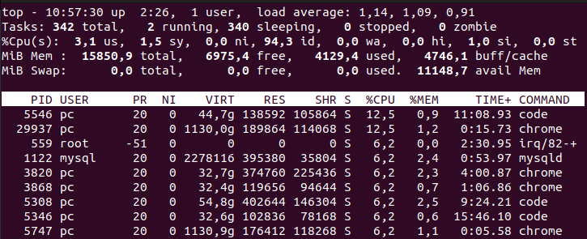
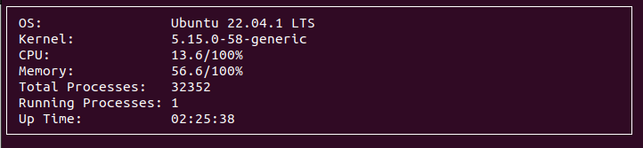

# Developing a top like monitor in C++

## Introduction

The main goal of this project was to develop an linux utility program for monitoring the system. The key concepts is that the system should work from terminal and display the CPU utilization, RAM usage and so on.

Some common Linux utilities include "ls" for listing files, "grep" for searching through text, and "apt" for installing software packages. Overall, Linux utilities are an essential part of the Linux operating system and are widely used by system administrators and users.

## top command

top is a command line utility for Linux and Unix-like operating systems that displays information about the processes running on the system. It is similar to the Unix command ps, but provides a more dynamic real-time view of a running system. It can display system summary information as well as a list of processes or threads currently being managed by the Linux kernel. It can also display a summary of the resources used by each process.

top command example:

## top monitoring

top monitor just works like top command. It displays the system summary information and list of processes currently being managed by the Linux kernel. It also displays a summary of the resources used by each process.

## System information

System information for the process manager is derived from the following system files:

1. Kernel information - /proc/version
2. Operating system - /etc/os-release
3. Memory utilization - /proc/meminfo
4. Total processes - /proc/meminfo
5. Running processes - /proc/meminfo
6. Up time - /proc/uptime
7. CPU usage - /proc/stat

# References:

- [Ncurses](https://opensource.com/article/21/8/ncurses-linux) 
- [Ncurses text](https://www.linuxjournal.com/content/programming-text-windows-ncurses) 
- [Tutorial](https://www.youtube.com/watch?v=pjT5wq11ZSE)
